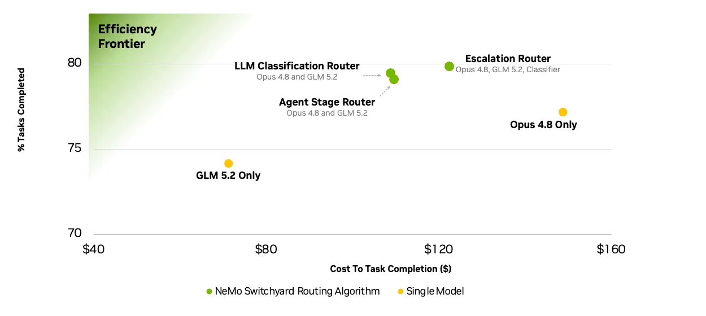

  

# NVIDIA NeMo Switchyard

Switchyard is an open-source library that helps an AI agent choose which model handles each request. It combines efficient models with more capable models so you can balance task success, cost, and latency on your workload.

Use Switchyard through a gateway integration, try it with a local proxy, or embed it in your own harness. You choose the model pool. Switchyard supplies the routing decision. Your gateway or application owns the surrounding service.

## How it works

1. Configure the models your application can use and choose a routing algorithm.
2. The algorithm examines the request or the agent's recent tool activity. Some algorithms call a model to judge the task.
3. Your gateway or application sends the request to the selected model. Routing can change as the agent continues its work.

Evaluate the complete agent, model pool, and routing configuration against your single-model baseline. A cheaper model call does not guarantee a cheaper successfully completed task.

## How to use it

### Through an existing gateway

| Gateway | Start here | Current limits |
| --- | --- | --- |
| **LiteLLM** | [Run the Switchyard routing-plugin example](examples/litellm/README.md#quick-start-with-the-local-proxy) | Experimental and checkout-only. The example pins LiteLLM 1.102.0 and supports Stage routing based on request history, plus Random routing. It cannot service intermediate model calls required by classifier or escalation algorithms. |
| **NeMo Relay** | [Build and configure the native plugin](crates/switchyard-nemo-relay-plugin/README.md#build-from-source) | Requires Relay `>=0.8.0, <1.0.0`. The source-build path requires a Rust toolchain and Python 3. |

Relay 0.8.x and 0.9.0 can lose upstream error status and details when the plugin
is enabled, even for models outside its routes. Review the
[upstream error compatibility note](docs/integrations/nemo_relay.md#upstream-error-compatibility)
before enabling the plugin.

These are integration paths you configure in your own deployment. They are not a hosted Switchyard endpoint. Follow each gateway's deployment guidance for credentials and service operation.

### Try routing locally

[Try routing locally](docs/getting_started.md#server-path) with the standalone proxy for demos and evaluation.

Agent-specific guides are available for [pi](docs/integrations/pi.md) and
[Oh My Pi](docs/integrations/oh_my_pi.md).

### Embed the library in your harness

[Embed the library in your harness](docs/getting_started.md#library-path) to run routing inside your Rust application. For Python, see the [embedding example](examples/libsy.py).

## Routing algorithms

Start with Auto. Choose Task, Execution, or Composite when you need more control. These names describe routing choices. The configuration keys are unchanged.

| Choice | How it chooses | TOML configuration |
| --- | --- | --- |
| **[Auto](docs/routing_algorithms/overview.md#auto)** | Uses the current default: Execution (Stage), efficient-first, with a confidence threshold of 0.5 and no classifier call. | `type = "auto"` |
| **[Task](docs/routing_algorithms/llm_classifier_routing.md)** | A model judges whether the efficient model can handle the task. | `type = "llm_classifier"`, `mode = "capability"` |
| **[Execution](docs/routing_algorithms/stage_router_routing.md)** | Uses recent tool activity and outcome signals to choose a model as the agent runs. | `type = "stage_router"` |
| **[Composite](docs/routing_algorithms/composite_routing.md)** | Combines Task and Execution: a classifier sets the default model tier when execution signals are uncertain. | `type = "composite"` |

Auto is a fixed preset in v0.3.0. It does not compare strategies at runtime. The TOML runner supports `type = "auto"`. For direct Python embedding, use `stage_router(picker="efficient_first", confidence_threshold=0.5)` for the same preset.

The [routing overview](docs/routing_algorithms/overview.md) retains the full catalogue, including [Plan/Execute](docs/routing_algorithms/plan_execute_routing.md), [escalation](docs/routing_algorithms/escalation_router_routing.md), [advisor](docs/routing_algorithms/advisor_gate_routing.md), [sub-agent](docs/routing_algorithms/subagent_routing.md), and [random](docs/routing_algorithms/random_routing.md) strategies. Integration support varies: check the gateway guide before choosing an algorithm.

## Evaluation and reference

Results depend on the benchmark, model pool, serving stack, and routing configuration.
For latency and routing overhead testing, see [Soak Testing](docs/operations/soak_test.md).

### Further reading

- [Benchmark setup and profiles](benchmark/README.md): run your own baseline and routing comparisons.
- [Core concepts](docs/core_concepts.md): clients, targets, routes, and model IDs.
- [TOML schema](docs/reference/toml_schema.md): configuration fields and defaults.
- [Architecture](docs/architecture.md): library and runtime components.
- [Installation](INSTALLATION.md): package and platform requirements.

## Components

Pre-1.0 software. APIs, configuration, and routing behavior can change between
releases. Pin the version you integrate.

| Component | Stability | Use it for | Guidance |
|---|---|---|---|
| `switchyard-libsy` | **Beta** | Routing embedded in your own gateway or harness. You own model calls, credentials, and retries. | Trial integrations. API will change before v1.0. |
| `switchyard-llm-client` | **Alpha** | HTTP model calls and protocol translation alongside libsy. | Experiments and pilots. |
| `switchyard-runner` | **Alpha** | Running configured routes inside another runtime, such as NeMo Relay. | Integration work and supervised pilots. |
| `switchyard-server` | **Demo** | A standalone OpenAI- and Anthropic-compatible proxy. | Demos and evaluation only. Not for production. |

## Community and license

[Report an issue](https://github.com/NVIDIA-NeMo/Switchyard/issues) · [Contribute](CONTRIBUTING.md) · [Code of conduct](CODE_OF_CONDUCT.md)

[Apache 2.0](LICENSE). Copyright NVIDIA Corporation.
