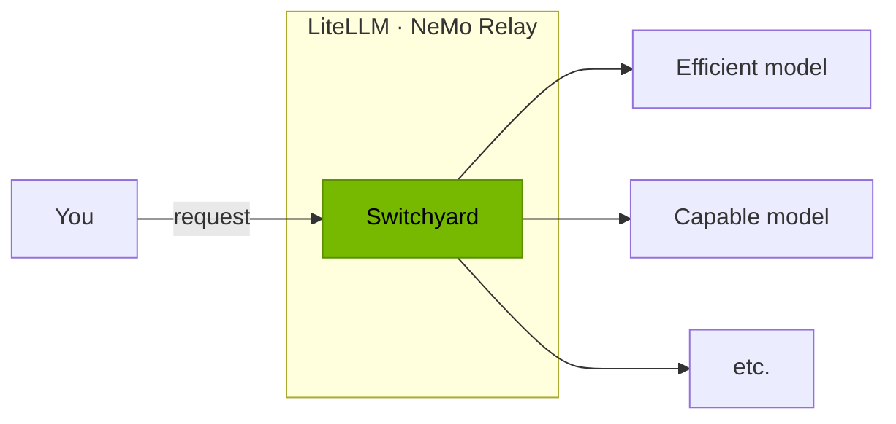
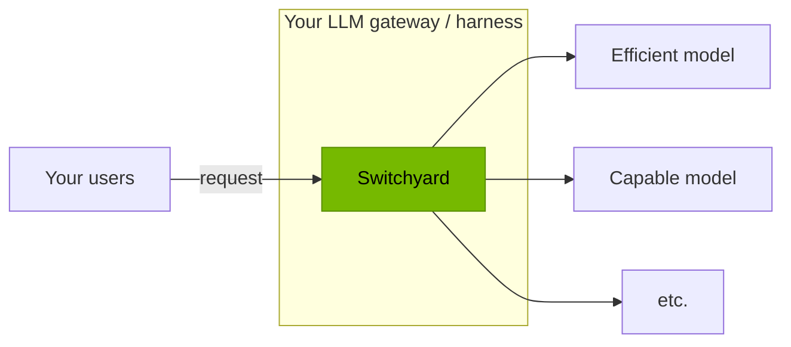
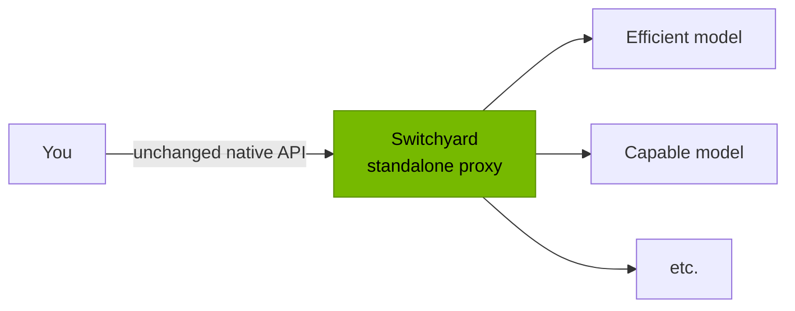

<p align="center">
  
</p>

# Switchyard

**Switchyard routes each LLM call to the cheapest model that can still do the job. Without changing a line of your agent.**

**[Get started →](#get-started)**


_\*Total cost based on average ISP token cost_

## What is Switchyard

Switchyard picks which model serves each LLM call.

### Use Switchyard

Switchyard runs inside gateways you may already have.

- **NeMo Relay** — a native plugin. Load a `routes.toml` into a Relay deployment
  you already run. [Setup →](#path-1--load-the-nemo-relay-plugin)
- **LiteLLM** — a routing plugin for LiteLLM's `Router` and proxy.
  [`examples/litellm`](examples/litellm/README.md)
- **More integrations** coming soon.



### Integrate Switchyard into your gateway or harness

Embed the routing algorithms in your own. Switchyard picks the model; your
harness makes the call, so your transport, retries, and credentials stay
untouched.

- Install: `pip install nemo-switchyard`
- Then follow [Path 2 — Embed the Library](#path-2--embed-the-library):
  construct an algorithm, drive its step stream, make the answer call.
- Also available for Rust as `switchyard-libsy`; Path 2 has the `Cargo.toml`
  block.



### Run Switchyard as a standalone proxy

A server in front of an agent, when you have no gateway to put Switchyard in:

```bash
cargo install --locked switchyard-server
switchyard-server --config routes.toml --port 4000
```

Point Claude Code, Codex CLI, or any OpenAI/Anthropic SDK client at the proxy.
Switchyard decides per turn which model serves it.



## Components

Pre-1.0 software. APIs, configuration, and routing behavior can change between
releases — pin the version you integrate.

| Component | Stability | Use it for | Guidance |
|---|---|---|---|
| `switchyard-libsy` | **Beta** | Routing embedded in your own gateway or harness. You own model calls, credentials, and retries. | Trial integrations. API will change before v1.0. |
| `switchyard-llm-client` | **Alpha** | HTTP model calls and protocol translation alongside libsy. | Experiments and pilots. |
| `switchyard-runner` | **Alpha** | Running configured routes inside another runtime, such as NeMo Relay. | Integration work and supervised pilots. |
| `switchyard-server` | **Demo** | A standalone OpenAI- and Anthropic-compatible proxy. | Demos and evaluation only. Not for production. |

## Get Started

Three paths, in the same order as above. Each is self-contained: start at
step 1, stop when you reach the result named under the heading.

### Path 1 — Load the NeMo Relay Plugin

You finish with an existing NeMo Relay deployment routing through Switchyard.
Requires NeMo Relay `>=0.8.1,<0.9.0` and a Rust toolchain to build the plugin.

**1. Build, package, and register the plugin.** Follow steps 1–3 of the
[install guide in the plugin README](crates/switchyard-nemo-relay-plugin/README.md#install).
They build the shared library, package it into a bundle with a digest-bearing
`relay-plugin.toml`, and register it with `nemo-relay plugins add`.

**2. Write the Switchyard deployment** to `/etc/switchyard/routes.toml` — the
same version-1 TOML the proxy uses. Copy the file from step 2 of Path 3 below.

**3. Point the plugin at the deployment.** Add a `config` table to the
`[[plugins.dynamic]]` entry that `nemo-relay plugins add` wrote, plus the
policy override that lets Relay load the unsigned bundle. Use exactly one
deployment source: a path, as here, or the config nested under
`switchyard_config`.

```toml
[[plugins.dynamic]]
manifest = "./plugins/switchyard/relay-plugin.toml"

[plugins.dynamic.config]
priority = 0
switchyard_config_path = "/etc/switchyard/routes.toml"

[plugins.policy.overrides."nvidia.switchyard"]
attestation = "integrity_only"
```

**4. Enable, validate, and restart Relay.**

```bash
nemo-relay plugins enable nvidia.switchyard
nemo-relay plugins validate nvidia.switchyard
```

Relay now runs any algorithm `switchyard-runner` supports, while Switchyard
owns provider HTTP dispatch.

Details: [`switchyard-nemo-relay-plugin`](crates/switchyard-nemo-relay-plugin/README.md)
and the [TOML schema reference](docs/reference/toml_schema.md).

### Path 2 — Embed the Library

You finish with your own harness picking a model per request and still making
every model call itself. Shown in Python; the Rust API has the same shape.

**1. Install.** The `Step` and `LlmResponse` API below is newer than the
`nemo-switchyard` 0.2.0 release on PyPI, which exposes an older `LlmTarget`
based interface. Until the next release, build from source (requires a Rust
toolchain):

```bash
pip install git+https://github.com/NVIDIA-NeMo/Switchyard.git
```

For Rust, the `v0.2.0` tag has the older `run_stream` shape too, so depend on
the repository's `main` branch and pin the `rev` you tested:

```toml
[dependencies]
async-trait = "0.1"
futures = "0.3"
switchyard-libsy = { git = "https://github.com/NVIDIA-NeMo/Switchyard.git", branch = "main" }
switchyard-protocol = { git = "https://github.com/NVIDIA-NeMo/Switchyard.git", branch = "main" }
tokio = { version = "1", features = ["macros", "rt"] }
```

**2. Construct an algorithm.** Target names are whatever your harness calls its
models. This is the stage router from the benchmark; `random`,
`llm_task_classifier`, and `llm_classifier` are built the same way.

```python
from switchyard.libsy import LlmResponse, Step
from switchyard.libsy.algorithms import stage_router

algorithm = stage_router(
    "capable",
    "efficient",
    picker="efficient_first",
    confidence_threshold=0.5,
)
```

**3. Drive it.** `run_stream` takes a normalized Switchyard request dict, not
an OpenAI wire payload: the `Request` shape from
[`switchyard-protocol`](crates/protocol/README.md), with `messages` whose
`content` is a list of typed blocks. It yields steps. A `CallModel` step is a
classifier or judge call — make it with your own client and hand back the
normalized response wrapped in `LlmResponse.Agg`. `Done` carries the pick.

```python
async def call_with_fallback(request: dict, models: list[str], clients: dict) -> LlmResponse.Agg:
    error: Exception | None = None
    for model in models:
        try:
            return LlmResponse.Agg(await clients[model].call({**request, "model": model}))
        except Exception as exc:
            error = exc
    raise error or RuntimeError("no candidate models")


async def route(request: dict, clients: dict) -> LlmResponse.Agg | LlmResponse.Stream:
    async for step in algorithm.run_stream(request):
        match step:
            case Step.CallModel(call):
                try:
                    call.respond(await call_with_fallback(call.request, call.models, clients))
                except Exception as error:
                    call.fail(error)
            case Step.Done(outcome):
                if outcome.response is not None:
                    return outcome.response
                return await call_with_fallback(
                    outcome.request, outcome.selected_model_ids, clients
                )
    raise RuntimeError("algorithm ended without a decision")
```

`clients` maps each target name to your existing client; each `call` takes a
normalized request dict and returns a normalized response dict. `call.models`
and `outcome.selected_model_ids` list candidates in order, so the helper tries
each one before giving up. `outcome.request` is the request to send, which may
carry a rewrite the algorithm applied. When `outcome.response` is set, routing
already produced the answer and no further call is needed.

**4. Make the answer call** with your own HTTP client, retries, and
credentials, as `call_with_fallback` does above. A complete runnable version,
including streaming responses, is in [`examples/libsy.py`](examples/libsy.py).

Type reference: [`switchyard-libsy`](crates/libsy/README.md) and
[`switchyard-protocol`](crates/protocol/README.md). In Rust the loop is
`Algorithm::run_stream` yielding `Step::CallModel` and `Step::Done`, with
`switchyard-llm-client`'s `run` available to drive it for you.

### Path 3 — Run the Standalone Proxy

You finish with a server on `localhost:4000` that any OpenAI or Anthropic client
can call. Needs [Rust with Cargo](https://rust-lang.org/tools/install/).

**1. Install the server.**

```bash
cargo install --locked switchyard-server
```

**2. Write `routes.toml`.** A stage router over the same model pair as the
benchmark above: how to reach a provider, which models to use, how to choose
between them. `--config` takes any path; this writes it to the current directory.

```bash
cat > routes.toml <<'TOML'
schema_version = 1

[llm_clients.openrouter]
format = "openai_chat"
base_url = "https://openrouter.ai/api/v1"
api_key_env = "OPENROUTER_API_KEY"

[targets.capable]
id = "anthropic/claude-opus-4.8"
llm_client = "openrouter"

[targets.efficient]
id = "z-ai/glm-5.2"
llm_client = "openrouter"

[routes.switchyard]
id = "switchyard"
type = "stage_router"
capable_target = "capable"
efficient_target = "efficient"
picker = "efficient_first"
confidence_threshold = 0.5
TOML
```

Every key is documented in the [TOML schema reference](docs/reference/toml_schema.md).

**3. Start it.** `--dry-run` loads the config, prints `server OK:` and the model
IDs it exposes, then exits without starting the server.

```bash
export OPENROUTER_API_KEY="your-openrouter-key"  # pragma: allowlist secret
switchyard-server --config routes.toml --dry-run
switchyard-server --config routes.toml --host 127.0.0.1 --port 4000
```

**4. Send a request.** The route's `id` is the model name clients ask for.

```bash
curl http://localhost:4000/v1/chat/completions \
  -H "Content-Type: application/json" \
  -d '{"model":"switchyard","messages":[{"role":"user","content":"hello"}]}'
```

The same route also answers on `/v1/messages` (Anthropic Messages) and
`/v1/responses` (OpenAI Responses). `/v1/stats` reports which target served
what, and `/metrics` exposes Prometheus counters for requests, errors, latency,
tokens, and routing overhead.

**5. Point a coding agent at it.**

```bash
export ANTHROPIC_BASE_URL="http://localhost:4000"
export ANTHROPIC_MODEL="switchyard"
claude
```

Codex CLI and other OpenAI clients use the OpenAI variables instead:

```bash
export OPENAI_BASE_URL="http://localhost:4000/v1"
```

## Routing Algorithms

Most use an LLM as a judge. All of them pick between an **efficient** model and a
**capable** one; what differs is when the decision is made and how.

| Algorithm | How it decides | Route `type` | Benchmark |
|---|---|---|---|
| **[Capability](docs/routing_algorithms/llm_classifier_routing.md)** | The first request is judged by an LLM. | `llm_classifier` | 71.2% at $79.32 |
| **[Stage](docs/routing_algorithms/stage_router_routing.md)** | Tool responses are judged by pattern matching or an LLM. | `stage_router` | 72.7% at $68.19 |
| **[Capability + Stage](docs/routing_algorithms/composite_routing.md)** | Combines the two above. | `composite` | not yet benchmarked |
| **[Escalation](docs/routing_algorithms/escalation_router_routing.md)** | Starts efficient. Responses are judged by an LLM for issues, then escalated. | `llm_classifier` + `mode = "escalation"` | 75.7% at $85.00 |
| **[Advisor Gate](docs/routing_algorithms/advisor_gate_routing.md)** | One model serves every turn; a stronger advisor approves its plans and "done" claims, or sends it back. | `advisor` | lifts a weak executor 43.8% → 54.7% |
| **[Sub-Agent-Aware](docs/routing_algorithms/subagent_routing.md)** | Delegated sub-agent traffic routes separately from the parent agent. | `subagents` on `passthrough` or `stage_router` | not yet benchmarked |
| **[Custom](docs/routing_algorithms/llm_classifier_routing.md#custom-multi-target-routing)** | The first request is judged by an LLM against criteria you define, routing among 2+ of your own models. | `llm_classifier` + `target_selector` policy | not yet benchmarked |
| **[Random](docs/routing_algorithms/random_routing.md)** | Each request is routed at random, uniform or weighted. | `random` | baseline mechanism |

Benchmarks are Terminal-Bench 2.1 against a $98.06 Opus 4.8 baseline at 76.0%.
A `passthrough` route registers one target under one model ID with no routing
decision. See the [Routing Overview](docs/routing_algorithms/overview.md) for
the common route shape and self-hosted targets.

## Documentation

- **[Core Concepts](docs/core_concepts.md)**: LLM clients, targets, routes, model IDs, and routing algorithms
- **[Routing Overview](docs/routing_algorithms/overview.md)**: choose and configure a routing algorithm
- **[TOML Schema](docs/reference/toml_schema.md)**: every configuration key
- **[Architecture](docs/architecture.md)**: how the proxy and library components fit together
- **[`switchyard-server`](crates/switchyard-server/README.md)**: server configuration, routing algorithms, and metrics
- **[`switchyard-libsy`](crates/libsy/README.md)**: embed routing algorithms in a Rust application
- **[`switchyard-protocol`](crates/protocol/README.md)**: provider-neutral request, response, and streaming types
- **[`switchyard-translation`](crates/switchyard-translation/README.md)**: request, response, and stream translation
- **[`switchyard-nemo-relay-plugin`](crates/switchyard-nemo-relay-plugin/README.md)**: install Switchyard as a native NeMo Relay plugin

## Benchmark Provenance

| Configuration | Accuracy | Total cost | vs. Opus 4.8 baseline |
|---|---:|---:|---|
| Opus 4.8 baseline | 76.0% | $98.06 | — |
| **[Escalation](#routing-algorithms)** | 75.7% | $85.00 | 99.6% of accuracy, 13.3% cheaper |
| **[Stage](#routing-algorithms)** | 72.7% | $68.19 | 95.7% of accuracy, 30.5% cheaper |
| **[Capability](#routing-algorithms)** | 71.2% | $79.32 | 93.7% of accuracy, 19.1% cheaper |
| Kimi K2.6 alone | 55.8% | $76.28 | |
| GLM 5.2 alone | 52.4% | $16.47 | |
| DeepSeek V4 Pro alone | 48.7% | $96.92 | |
| Ultra 3 alone | 39.0% | $29.66 | |

These are the v0.2.0 Terminal-Bench 2.1
results from [Route AI Agent Workloads Across Models with NVIDIA NeMo Switchyard](https://developer.nvidia.com/blog/route-ai-agent-workloads-across-models-with-nvidia-nemo-switchyard/).
Those runs used NVIDIA-internal inference endpoints, so absolute solve rates may
shift on another serving stack; the routing parameters are the ones that ran.

The escalation deployment is checked in at
[`benchmark/routing-profiles/tb21-escalation-opus-glm-deepseek.toml`](benchmark/routing-profiles/tb21-escalation-opus-glm-deepseek.toml),
with OpenRouter targets substituted so it is publicly runnable. To run the
harness, see [`benchmark/README.md`](benchmark/README.md); for latency and
routing overhead rather than task success, see
[Soak Testing](docs/operations/soak_test.md).

## Community

- **Issues**: [GitHub Issues](https://github.com/NVIDIA-NeMo/Switchyard/issues)
- **Code of Conduct**: [Code of Conduct](CODE_OF_CONDUCT.md)

## License

[Apache 2.0 License](LICENSE). Copyright NVIDIA Corporation.
