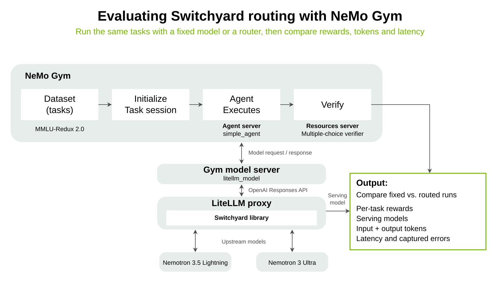

# Evaluate Switchyard routing with NeMo Gym

[NeMo Gym](https://github.com/NVIDIA-NeMo/Gym) is a library for evaluating and improving models and agents, combining infrastructure for developing environments and running evaluation and training at scale with popular benchmarks and training environments.

Gym provides the evaluation substrate: it supplies benchmark tasks, runs the model interaction, verifies answers, and reports rewards. Switchyard sits in the request path and selects the upstream model.

This tutorial uses [MMLU-Redux 2.0](https://huggingface.co/datasets/edinburgh-dawg/mmlu-redux-2.0) to compare a fixed model with Switchyard routing.

We compare a fixed Nemotron 3 Ultra baseline with seeded Random routing between Ultra and Nemotron 3.5 Lightning. Both conditions use the same questions and generation settings.



## 1. Set up

You need:

- Bash on Linux/macOS
- Git and curl
- [uv](https://docs.astral.sh/uv/)
- The [Rust toolchain prerequisites](../../docs/getting_started.md#prerequisites) for the current checkout bindings
- An NVIDIA API key from [build.nvidia.com](https://build.nvidia.com/) with access to `nvidia/nemotron-3-ultra-550b-a55b` and `nvidia/nemotron-3.5-lightning-30b-a3b`

Run these commands in Bash from the Switchyard repository root. These one-time commands create a Gym checkout under `scratch/` at the tested `v0.6.0` release. Choose an unused `GYM_DIR` without spaces or shell metacharacters.

```bash
export GYM_DIR="$PWD/scratch/nemo-gym-litellm/Gym"
mkdir -p "$(dirname "$GYM_DIR")" &&
git clone https://github.com/NVIDIA-NeMo/Gym.git "$GYM_DIR" &&
git -C "$GYM_DIR" checkout v0.6.0 &&
uv tool run --from uv==0.11.29 uv sync \
  --directory "$GYM_DIR" --frozen --no-dev --python 3.13.14 &&
uv tool run --from uv==0.11.29 uv pip install --no-deps \
  --python "$GYM_DIR/.venv/bin/python" uv==0.11.29 &&
"$GYM_DIR/.venv/bin/uv" sync --project examples/litellm --locked --python 3.12
```

Gym and LiteLLM use separate Python environments. The proxy builds Switchyard bindings from this checkout; the native CLI workflow does not need Docker.

## 2. Run both conditions

The default is five tasks per condition with an 8,192-token output limit, normally ten upstream calls when every request succeeds on its first attempt.

Replace the placeholder below with your NVIDIA API key, then run.

```bash
export NVIDIA_API_KEY="your-api-key"
bash benchmark/nemo_gym/run.sh
```

The [runner](./run.sh) prepares MMLU-Redux, starts the local LiteLLM proxy, evaluates fixed then routed, stops the proxy, and prints the comparison. It saves `comparison.txt` and other artifacts under `benchmark/nemo_gym/results/<timestamp>/`.

You do not need to run these commands separately, but at a high level, the runner does:

```text
gym eval prepare --benchmark mmlu-redux
gym eval run --benchmark mmlu-redux --model-type litellm_model --model <fixed|routed> ...
```

Runtime varies with endpoint load, model latency, and retries.

### How the requests are wired

Gym's `litellm_model` adapter connects to the local proxy through `policy_base_url`. The runner requests `--model fixed`, then `--model routed`; these are the model-group names in [litellm.yaml](litellm.yaml):

| Group | Available models |
|---|---|
| `fixed` | Nemotron 3 Ultra |
| `routed` | Nemotron 3 Ultra and Nemotron 3.5 Lightning |

These are LiteLLM group names, not special Gym modes. The same Ultra configuration is reused in both groups, and thinking is disabled for both models for this short multiple-choice workload.

The existing [Switchyard–LiteLLM integration](../../examples/litellm/README.md) chooses from each group using [routes.toml](routes.toml), which sets `algorithm = "random"` and `seed = 6`. Switchyard runs as a library inside LiteLLM, not as another server.

A small tutorial callback fixes response fields needed by Gym `v0.6.0` and records which deployment served each response. It does not choose models or count tokens. Gym supplies the captured-call usage and errors.

This tutorial demonstrates the LiteLLM path. See Gym's [full Switchyard integration documentation](https://docs.nvidia.com/nemo/gym/main/model-server/switchyard/) for its other deployment modes and configuration options.

Gym components can outlive the command briefly; let them finish shutting down before an immediate rerun.

## 3. Understand the result

Start with task coverage and serving models, then compare rewards, tokens, and latency. This is the output from a live run of the default five tasks per condition:

```text
fixed: expected=5, completed=5, missing=0, unexpected=0, failures=0
routed: expected=5, completed=5, missing=0, unexpected=0, failures=0
Pairing: matched=5, fixed-only=0, routed-only=0

Metric                                 fixed         routed
Paired rollouts                            5              5
Incomplete responses                       0              0
Mean reward                            0.400          1.000
Captured input tokens                    598            598
Captured output tokens                    30            754
Mean rollout latency (ms)           6645.761       9763.644
Captured calls                             5              5
Captured failed calls                      0              0
Calls with unknown usage                   0              0

fixed serving models: {"nvidia_nim/nvidia/nemotron-3-ultra-550b-a55b": 5}

routed serving models: {"nvidia_nim/nvidia/nemotron-3-ultra-550b-a55b": 2, "nvidia_nim/nvidia/nemotron-3.5-lightning-30b-a3b": 3}

Gym-scored incomplete responses remain in the comparison. Gym-captured tokens include extra attempts; +unknown means some usage was not reported.
Random makes no classifier calls. A small run demonstrates the integration, not a routing advantage.
```

- **Pairing:** the comparator matches fixed and routed rollouts by task and repeat, then confirms their inputs and settings are identical. Missing results or terminal Gym failures stop the comparison so averages are not calculated from different workloads.
- **Incomplete responses:** a model can hit its output limit while Gym still records and scores the rollout. These responses remain in the comparison and are reported with a warning.
- **Models:** fixed stayed on Ultra, while routed used Ultra and Lightning. The counts describe the final serving deployment, not every attempted model. A small Random run need not split evenly.
- **Reward:** Gym's multiple-choice verifier scores the boxed answer letter (correct = 1, wrong = 0).
- **Tokens:** input and output counts include all calls Gym captured, including extra attempts.

Calls retried inside Gym's model adapter, LiteLLM, or the upstream provider may not appear separately. These are Gym-captured measurements, not a complete provider bill or fallback trace.

Tokens are not dollar costs. The default five-task prefix is a smoke test, not a representative MMLU-Redux score; Random is not capability-based routing.

## 4. (Optional) Try a small change

- **Workload:** use a fresh results directory and adjust the task count:

  ```bash
  RESULTS_DIR="$PWD/benchmark/nemo_gym/results/my-run" \
    LIMIT=2 bash benchmark/nemo_gym/run.sh
  ```

- **Models:** edit [litellm.yaml](litellm.yaml), keeping one fixed candidate and two distinct routed candidates, including the fixed model. Keep per-model settings identical between conditions.
- **Routing:** change the seed in [routes.toml](routes.toml), keeping `algorithm = "random"`. A seed repeats assignments only for an identical request sequence; retries or concurrency can change them.
- **Another benchmark:** use `--benchmark NAME` in your own Gym calls against LiteLLM, with a compatible agent and verifier. The included runner is configured for MMLU-Redux; adapt the script and comparison logic for other benchmarks.

See `bash benchmark/nemo_gym/run.sh --help` for output, port, repeat, and concurrency options.

<details>
<summary>Saved files and token counts</summary>

Each `fixed/` and `routed/` folder contains:

- `rollouts.jsonl`: model responses and rewards.
- `rollouts_materialized_inputs.jsonl`: the tasks and settings used.
- `rollouts_failures.jsonl`: failed tasks, if any.
- `model-calls/`: Gym's captured model exchanges.
- `models.jsonl`: response IDs and serving models.

The result root also contains `comparison.txt` and `versions.txt`, recorded for reference.

If something fails, start with that folder's `gym.log` or the result folder's `litellm.log`.

To view the comparison again without calling the models, replace `my-run` with your results folder:

```bash
"$GYM_DIR/.venv/bin/python" benchmark/nemo_gym/compare.py \
  benchmark/nemo_gym/results/my-run
```

Older result folders without `models.jsonl` do not support this report; keep their saved `comparison.txt`.

Keep the saved inputs because the source dataset can change. Request logs contain prompts and responses, so review them before sharing.

</details>

**Validation:** tested with Gym `v0.6.0`, and as a live run of five tasks per condition. Ultra and Lightning were both exercised, and all ten captured calls succeeded.
