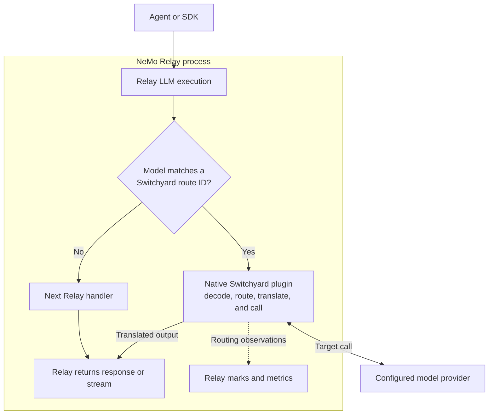
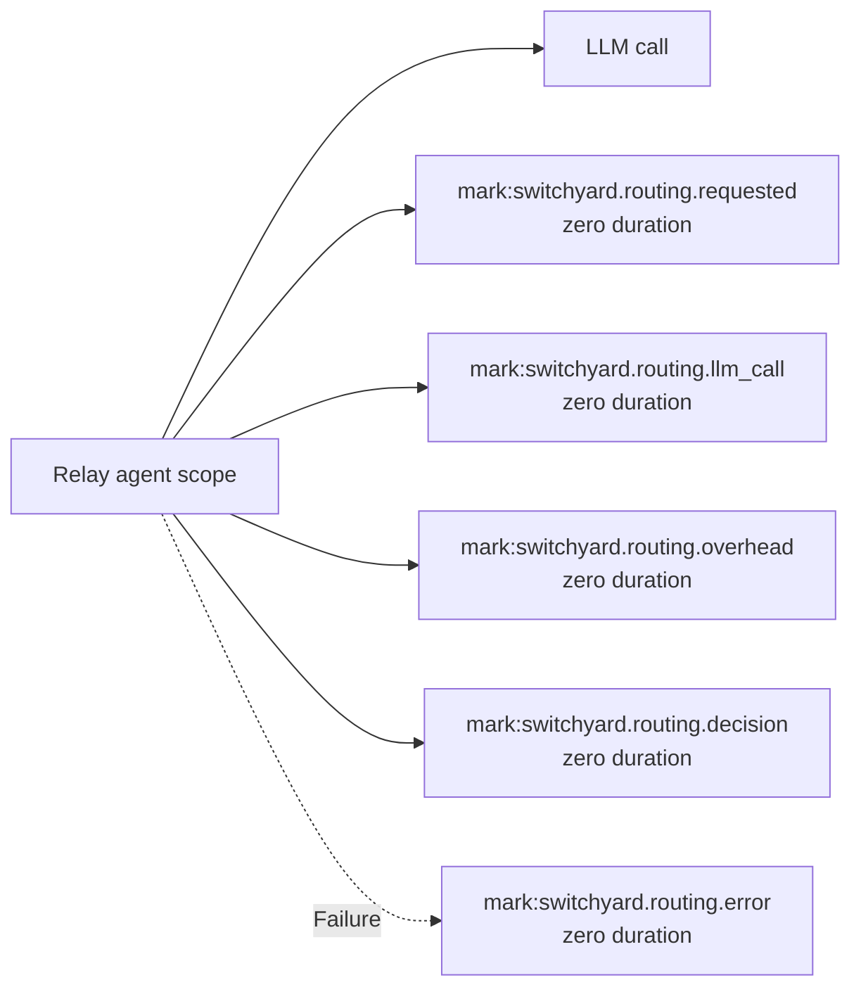

# Use Switchyard with NeMo Relay

The [Switchyard native plugin](../../crates/switchyard-nemo-relay-plugin/README.md)
loads Switchyard into an existing
[NeMo Relay runtime](https://docs.nvidia.com/nemo/relay/about-nemo-relay/overview)
deployment through Relay's
[native dynamic plugin system](https://docs.nvidia.com/nemo/relay/build-plugins/native/about).

## Why Use Switchyard with NeMo Relay?

Switchyard's routing algorithms select a model for each LLM request or step in
an agent trajectory, balancing cost and performance. The NeMo Relay integration
makes those algorithms available to coding agent harnesses supported by Relay.
The integration is not tied to one routing algorithm. It supports passthrough,
random, Stage, composite, advisor, and LLM classifier routes, including
capability, escalation, and custom modes.

The plugin reports the selected and served models, fallback use, routing
latency, and token use through Relay telemetry. Use it to answer:

- How often did the lower-cost model handle the work?
- How often did Switchyard fall back to another model?
- How much time and token use did routing add?
- Did the routed workload cost less than using one model for every request?

The plugin runs inside Relay, so the agent does not need to change and
Switchyard does not need to run as a separate service.

Requests for models that Switchyard does not manage continue through Relay as
usual.

Routing does not require Relay. You can instead run the
[standalone server](../getting_started.md#server-path) or embed
[`switchyard-libsy`](../../crates/libsy/README.md) directly.

### Measure the Cost of Routing

A routed request can spend tokens choosing a model and generating the answer.
Some routes call a judge or classifier first. The selected model, or a fallback,
then answers the request.

Relay records the request and answer seen by the agent. It can record a
provider-reported cost or estimate one when model pricing is configured.
Switchyard separately records model calls, available token usage and timing,
fallbacks, and failures.

The integration does not calculate a combined cost or savings figure. Relay can
price the answer returned to the agent, while Switchyard reports internal
routing usage separately. To estimate the observed cost for a workload, use:

```text
Relay answer cost + cost of Switchyard tokens where call_role = "routing"
```

Apply the price of each `target_model` to those routing tokens. Do not add
`call_role = "answer"` again because Relay already counted that answer. Do not
sum every `token_type`; `total` is a rollup, and cache or reasoning values may
already be included in broader counts.

Relay does not copy request identity into exported metric attributes. Use this
calculation for a workload or time window, not to reconcile one trace.

Relay does not include a model-price catalog. Follow its
[model-pricing guide](https://docs.nvidia.com/nemo/relay/configure-plugins/model-pricing)
to supply and validate model rates. Run the same representative workload once
with a fixed model and once with routing. Compare cost, latency, fallback rate,
and task success. Missing usage, failed attempts, internal HTTP retries, and
incomplete streams can leave some cost unknown. An absent value means unknown,
not zero.

## How Requests Flow

Relay loads the plugin into its own process. For each supported model request,
the plugin checks whether the requested model matches a configured Switchyard
route. Matching requests go through Switchyard. Other requests are left
unchanged by Switchyard and passed to the next Relay handler. The plugin uses
Relay's
[execution intercepts](https://docs.nvidia.com/nemo/relay/about-nemo-relay/concepts/middleware#execution-intercepts)
for non-streaming requests and
[stream execution intercepts](https://docs.nvidia.com/nemo/relay/about-nemo-relay/concepts/middleware#stream-execution-intercepts)
for streaming requests.



For a matching request, Switchyard performs model selection, provider calls,
retries, and fallback itself. Model calls used to make a routing decision, as
well as calls to the selected or fallback answer model, do not run through
Relay's LLM middleware again. This avoids treating a router's judge call or
fallback attempt as another application request.

Relay records the
[LLM call](https://docs.nvidia.com/nemo/relay/instrument-applications/instrument-llm-call#integration-pattern)
made by the application. Switchyard reports its internal routing work through
Relay
[marks](https://docs.nvidia.com/nemo/relay/about-nemo-relay/concepts/events#mark)
and metrics.

| Owner | Responsibilities |
| --- | --- |
| Relay | Receives the caller's request, runs Relay middleware, returns the response or stream, and exports telemetry. |
| Switchyard | Chooses a target, translates formats, calls the provider, and handles configured retries and fallback. |
| Model provider | Runs the model and returns its response, stream, and available usage. |

For more detail, see Relay's
[managed execution pipeline](https://docs.nvidia.com/nemo/relay/about-nemo-relay/architecture#managed-execution-pipeline)
and
[plugin delivery models](https://docs.nvidia.com/nemo/relay/about-nemo-relay/concepts/plugins#plugin-delivery-models).

## Set Up the Plugin

Follow the [plugin README](../../crates/switchyard-nemo-relay-plugin/README.md)
to build and package the native library, register and enable it in Relay, and
configure its deployment. Relay documents how to
[add and enable a discoverable plugin](https://docs.nvidia.com/nemo/relay/configure-plugins/discoverable-plugins#add-and-enable-a-plugin)
and how it
[validates the package before loading code](https://docs.nvidia.com/nemo/relay/configure-plugins/discoverable-plugins#validate-before-loading-code).

!!! note "Relay compatibility"

    The plugin requires `relay = ">=0.8.1,<0.9.0"` and native plugin API `1`.
    The packaged
    [`relay-plugin.toml`](../../crates/switchyard-nemo-relay-plugin/relay-plugin.toml)
    is the source of truth.

Configure exactly one Switchyard deployment source: either
`switchyard_config_path`, which points to the TOML used by `switchyard-server`,
or an inline version-1 deployment under `switchyard_config`. Both use the
[Switchyard TOML schema](../reference/toml_schema.md).

The plugin reuses the deployment's routes, targets, and LLM clients. It does not
use Switchyard's `fallback_client` for an unmatched model. Relay's next handler
decides what happens to that request.

The `id` of each configured Switchyard route becomes a model name that callers
can send through Relay. No additional Relay route table is required for those
model names.

## Request Handling

The plugin handles these Relay LLM calls:

- OpenAI Chat Completions (`openai.chat_completions`)
- OpenAI Responses (`openai.responses`)
- Anthropic Messages (`anthropic.messages`)

Only requests whose `model` is a string matching a Switchyard route ID are
routed. Other call types, missing or non-string model values, and unconfigured
model names are left unchanged by Switchyard and passed to Relay's next handler.

The caller and selected target may use different supported API formats.
Switchyard normalizes the request, routes it, and returns the response in the
caller's original format. If Switchyard forwards the caller's credential, both
formats must use the same credential family: OpenAI-compatible or Anthropic.

Support for provider-specific fields depends on the source and target formats.
Test any fields that your application relies on before deploying a translated
route.

### Header Forwarding

Caller headers are forwarded upstream except credentials and headers owned by
the HTTP client, such as connection and content headers. Authentication and
configured extra headers follow the selected client's settings in the
[TOML schema](../reference/toml_schema.md).

### Streaming

For streaming requests, Switchyard returns a translated stream that Relay
consumes lazily. Relay drives delivery and cancellation and records when the
stream starts and ends. Switchyard continues to translate chunks and record
late usage or errors as Relay consumes them.

- Initial routing marks are available when the stream opens.
- An answer-call result of `ok` means the provider opened the stream. It does
  not guarantee that the full stream completed.
- For a streamed upstream response, answer token metrics appear
  only if the provider reports usage and the stream reaches its final event. A
  canceled or dropped stream may have no answer-token metrics.
- Later provider failures can emit `switchyard.routing.error`. Some failures
  before routing or while encoding Relay output have no Switchyard mark, so the
  marks are not a complete request-failure log.
- If Relay rejects a telemetry event, the plugin writes the error to standard
  error and still returns the model response.

## State and Identity

The plugin keeps request and response data in memory only while handling the
call. For a stream, that data remains until the stream finishes or the caller
drops it. The plugin does not store these payloads on disk.

The plugin creates one Switchyard runner when Relay activates it and shares the
runner across requests until the plugin is deactivated. Some routing algorithms
keep in-memory state there, such as session affinity or an escalation decision.
State behavior and expiry depend on the algorithm. The state is not shared
between Relay processes and is lost when a process restarts. See Relay's
documentation on
[plugin ownership](https://docs.nvidia.com/nemo/relay/about-nemo-relay/concepts/plugins#ownership-and-scope)
and
[runtime state](https://docs.nvidia.com/nemo/relay/about-nemo-relay/architecture#where-runtime-state-lives).

The plugin adds these fields to each routing mark, including metric marks.
Missing values are `null`:

- `session_id`
- `agent_id`
- `parent_agent_id`
- `task_id`
- `turn_id`
- `correlation_id`

Subscribers and log or trace exporters can read them, but Relay does not copy
them into exported metric attributes.

These values come from request headers rather than Relay's active scope. Relay's
[session and subagent headers](https://docs.nvidia.com/nemo/relay/nemo-relay-cli/basic-usage#runtime-mapping)
can populate them for correlation. They do not by themselves mark a request as
delegated work for Switchyard's
[`subagents` router](../routing_algorithms/subagent_routing.md). For algorithms
that keep per-session state, reuse a stable ID across turns. The plugin accepts
`x-nemo-relay-session-id`; `x-switchyard-session-id` overrides it. If neither
provides a value, the Switchyard session ID remains unset.

## Routing Telemetry

Relay sees one LLM lifecycle for the request made by the agent. Switchyard
reports the routing work through Relay marks and metrics. Existing Relay
[subscribers](https://docs.nvidia.com/nemo/relay/about-nemo-relay/concepts/subscribers#how-subscribers-relate-to-events)
can receive these records, but each output format presents them differently.

### ATIF and OpenTelemetry Show Different Views

| Output | What the current integration shows |
| --- | --- |
| ATIF | The request and response seen by the agent. Internal routing is not added as separate steps or included in `final_metrics`. Relay-managed ATIF files may retain the raw records under `extra.observed_events`. |
| OpenTelemetry traces, including OpenInference | Relay's LLM span plus eligible routing marks, depending on the projection. Marks are point-in-time records, not duration spans. |
| OpenTelemetry metrics | Switchyard request, routing-call, latency, token, and failure measurements. Combine the reported routing usage with Relay's answer cost to estimate the observed routed cost. |
| OTLP logs | Non-metric Switchyard marks that meet the configured severity threshold. |

Switchyard creates `libsy.run`, `libsy.llm_call`, `libsy.client_call`, and
`libsy.upstream_attempt` spans internally. Together they cover the algorithm
run, model calls requested by the algorithm, candidate attempts including
fallbacks, and individual HTTP attempts. They are not one connected hierarchy
today, and the plugin does not send them to Relay. As a result, Relay traces do
not show those internal operations as nested duration spans or give an internal
stream its own cancellation lifecycle.

### How Routing Appears in Traces

In Relay's
[full and OpenInference trace projections](https://docs.nvidia.com/nemo/relay/configure-plugins/observability/opentelemetry#trace-projections),
[`mark_projection`](https://docs.nvidia.com/nemo/relay/configure-plugins/observability/opentelemetry#trace-endpoint-fields)
controls how marks appear. With `inherit` or `event`, a routing mark is an event
on its parent span while that span is open. Otherwise, Relay emits it as a
zero-duration span and retains its parent when possible. With `tool`, routing
marks are always visible zero-duration spans. The plugin does not nest these
marks under the LLM span. The
[`gen_ai` projection](https://docs.nvidia.com/nemo/relay/configure-plugins/observability/opentelemetry#genai-projection)
omits marks. With `mark_projection = "tool"`, the trace has this shape:



When the LLM call has an agent scope as its parent, the marks use that same scope
and appear beside the call. Without an agent scope, a backend can display the
LLM span and marks as separate roots. The metadata field
`parent_agent_id` is a correlation value; it does not set Relay trace
parentage. See Relay's
[scope hierarchy](https://docs.nvidia.com/nemo/relay/about-nemo-relay/concepts/scopes#scope-hierarchy-and-ownership)
for the parentage rules.

### Mark Contract

Dashboards and subscribers can use `data_schema` to identify the payload
contract. Each non-metric mark uses the mark name as its schema name and version
`1`. Consumers should accept additional fields and values within a version.
Removing or renaming a field, changing its type, or changing its meaning
requires a new version. Relay's
[event envelope](https://docs.nvidia.com/nemo/relay/about-nemo-relay/concepts/events#fields-common-to-every-event)
describes the surrounding event envelope.

| Mark | Severity | Data |
| --- | --- | --- |
| `switchyard.routing.requested` | Info | Routing `algorithm` for a managed request. |
| `switchyard.routing.llm_call` | Debug | `call_index`, `selected_model`, `call_role` (`routing` or `answer`), `outcome`, and `latency_ms` for each observed model call. |
| `switchyard.routing.overhead` | Info | `latency_ms` spent producing the routing outcome, including routing-model calls. This is not the end-to-end request duration. |
| `switchyard.routing.decision` | Info | `algorithm`, initial `selected_model`, nullable final `served_model`, and nullable `fallback_used`. |
| `switchyard.routing.error` | Error | Generic failures contain `failure_kind`. Route-execution failures also contain `category` and `phase`, plus nullable `upstream_status` and `target`. |

Call marks describe Switchyard observations, not every HTTP retry made inside a
client. `call_role` records whether Switchyard classified the call as routing
or answer work.

`switchyard.routing.llm_call` uses Debug severity. It still appears in the
supported trace projections, but Relay's OTLP logs default to Info. Set
`minimum_severity` to `debug` to include these call records in
[log export](https://docs.nvidia.com/nemo/relay/configure-plugins/observability/opentelemetry#log-export).

Switchyard marks use the target's upstream model ID, not its local TOML key.
Relay request telemetry normally uses the Switchyard route ID, while response
telemetry can report the model that answered.

`fallback_used` is `true` when the final served model differs from the initial
selection and `false` when they match. It and `served_model` are `null` when the
response does not provide serving metadata. If route execution fails before a
response is available, the error mark describes the terminal failure instead.

### Metrics

| Metric | Kind and unit | Meaning and attributes |
| --- | --- | --- |
| `switchyard.routing.requests` | Counter, events | Managed requests, labeled by `algorithm`. |
| `switchyard.routing.llm_calls` | Counter, events | Routing-model calls, labeled by `outcome`. |
| `switchyard.routing.llm_call.duration` | Histogram, milliseconds | Routing-model call duration, labeled by `outcome`. |
| `switchyard.routing.overhead` | Histogram, milliseconds | Time spent producing the routing outcome. |
| `switchyard.routing.llm_tokens` | Counter, tokens | Normalized token values derived from provider usage, labeled by `call_role`, `target_model`, and `token_type`. |
| `switchyard.routing.failures` | Counter, events | Terminal failures, labeled by safe failure kind and available classification fields. |

`switchyard.routing.llm_calls` and `switchyard.routing.llm_call.duration` cover
routing-model calls only. Answer calls appear in the per-call marks and token
metrics.

Token metrics cover routing and answer calls when the provider reports usage.
The plugin does not synthesize zeroes for missing values. The supported token
types are `input`, `cached_input`, `cache_creation_input`, `output`,
`reasoning`, and `total`.

Configure delivery through Relay's
[OpenTelemetry metric export](https://docs.nvidia.com/nemo/relay/configure-plugins/observability/opentelemetry#metric-export).

## Data Handling

Switchyard routing telemetry excludes request and response content. Its marks
do not contain prompts, bodies, headers, credentials, raw provider responses,
or free-form provider errors. Relay's LLM events can capture request and
response data according to Relay's
[input and output event semantics](https://docs.nvidia.com/nemo/relay/about-nemo-relay/concepts/events#input-and-output-payloads),
independently of these Switchyard marks.
