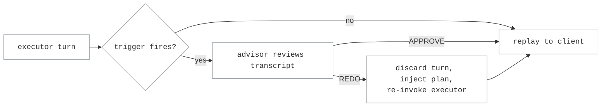

# Advisor-Gate Routing

Advisor-gate routing pairs an **executor** (the model under test, serving every
client-visible turn) with a stronger **advisor** that acts as a quality gate.
The executor works the task with its own tools; when it produces a terminal
turn — a plan before doing the work, or a claim that the task is complete — the
advisor reviews the session transcript and either lets the turn through
(APPROVE) or discards it and sends the executor back to work with a concrete
plan (REDO). The advisor is judge-only: it reviews turns but never serves one,
so clients only ever see executor output.

This differs from the classifier and router strategies: those decide *which
model serves a turn*, while the advisor gate keeps one model serving and spends
the stronger model only on verdicts at the moments that decide task success.

## How it works

Every request routes to the executor. The gate buffers each executor turn,
decides whether it needs review, and only then releases it to the client.

A review fires on one of two triggers:

- **`no_tool_call`** (default) — the executor's first turn without tool calls,
  the natural "I'm done or I have a plan" moment on function-calling agent
  harnesses. `gate_min_tool_results` skips early chatty turns: a no-tool-call
  turn is only reviewed once the conversation carries at least that many tool
  results.
- **`pattern`** — the first turn whose visible text matches
  `gate_trigger_pattern`, for text-protocol harnesses where every turn lacks
  tool calls and completion is declared with a textual marker instead.

Independently, `gate_stall_turns` adds a mid-task checkpoint: when a
conversation reaches that many assistant turns without ever triggering, the
next turn is reviewed once — catching executors that grind without declaring
completion.

The advisor receives the serialized transcript (task, actions, results, and the
gated turn) under a reviewer contract that demands APPROVE or REDO as the first
word of its reply. On APPROVE the buffered turn replays to the client verbatim,
preserved provider events included. On REDO the turn is discarded — the client
never sees it — and the advisor's plan is appended as user feedback, the
executor re-invoked, and its continuation served instead.



Reviews draw from a per-session budget of `max_reviews`. The budget scope is
the caller's `proxy_x_session_id` header when present — benchmark harnesses
stamp every request of one evaluation with it, sub-agents included, so the
budget means "reviews for this task" even behind a gateway shared by many
tasks — then the session id resolved from harness headers (such as
`x-switchyard-session-id`), and one scope per server when neither is present.
Failed consults refund the budget and count toward a separate cap of 3, which
bounds consult latency against a down advisor. An unparseable verdict also
refunds and passes the turn through as APPROVE.

Long sessions are truncated middle-out before the consult: the transcript keeps
the task statement at the start and the most recent work at the end, marked
`...<middle of the conversation truncated>...`, capped at
`transcript_max_chars`. With `fail_open = true` (default) any advisor failure
degrades to APPROVE; `fail_open = false` surfaces it as a server error instead.

Gate behavior is observable at `/v1/stats` under `advisor_gate`: verdicts by
trigger, consult failures by reason, and REDO-discarded turns with their token
counts (the client never saw those turns, so terminal usage accounting alone
would miss them).

## Configuration

```toml
[targets.executor]
id = "small/model"
llm_client = "provider"

[targets.advisor]
id = "frontier/model"
llm_client = "provider"

[routes.gated]
id = "switchyard/gated"
type = "advisor"
executor_target = "executor"
advisor_target = "advisor"
max_reviews = 3
gate_stall_turns = 30
gate_min_tool_results = 3
```

| Key | Default | Meaning |
|---|---|---|
| `executor_target` | required | Serves every client-visible turn. |
| `advisor_target` | required | Reviews gated turns; never a routing destination. |
| `gate_trigger` | `"no_tool_call"` | What fires a review: `no_tool_call` or `pattern`. |
| `gate_trigger_pattern` | unset | Regex for the `pattern` trigger; required by and exclusive to it. |
| `max_reviews` | `1` | Review budget per session scope; later triggers re-review until spent. |
| `gate_stall_turns` | `0` (off) | Mid-task checkpoint after this many assistant turns. |
| `gate_min_tool_results` | `0` | Minimum tool results before a `no_tool_call` turn is reviewable. |
| `advisor_max_tokens` | `2048` | Output cap for each advisor consult. |
| `advisor_temperature` | unset | Sampling temperature for consults; omitted when unset. |
| `transcript_max_chars` | `200000` | Middle-out cap on the serialized transcript (~50k tokens). |
| `fail_open` | `true` | Advisor failure passes the turn through instead of erroring. |
| `reviewer_system_prompt` | built-in | Overrides the APPROVE/REDO reviewer contract. |
| `redo_feedback_prefix` | built-in | Overrides the prefix injected before a REDO plan. |

## Tuning

The defaults gate once per session at the first terminal turn. On agentic
coding harnesses, the configuration that benchmarked best is `max_reviews = 3`,
`gate_stall_turns = 30`, `gate_min_tool_results = 3`: skip the early commentary
turns, keep a mid-task checkpoint for grinders, and allow a re-review after a
REDO.

Expect the gate's value to depend on the executor. On Terminal-Bench 2.1 with a
coding agent it lifted a weak executor by 11 points (43.8% → 54.7% ± 0.7,
k=3) by catching premature "done" claims and stalls, while on a strong executor
it only matched the accuracy of the takeover-style routers — strong executors
rarely produce the diligence failures a review can catch. If your executor is
already frontier-class, benchmark
[stage-router routing](stage_router_routing.md) first; reach for the advisor
gate when the executor is markedly weaker than the best model you can call, or
when you need a review trail rather than a model swap.
