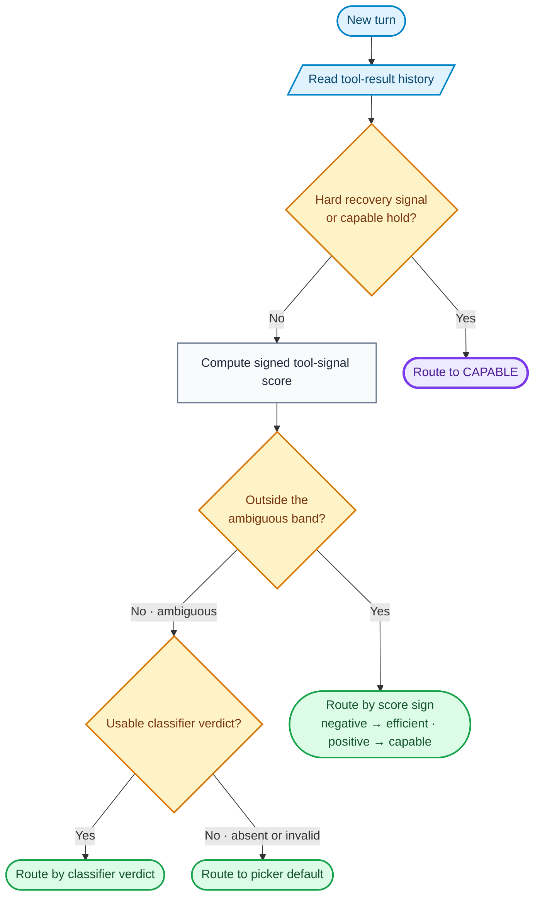
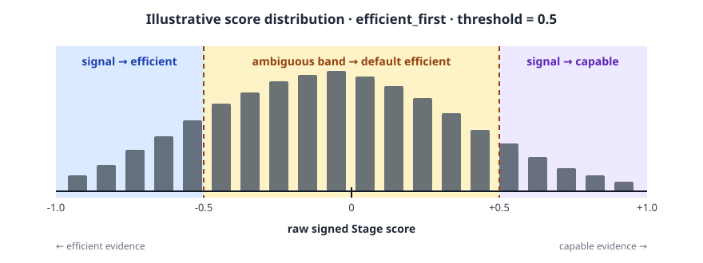

# Stage Router

**Execution** routing uses the stage router to choose a model from tool results
and agent progress. Configure it with `type = "stage_router"`.

Stage-router routing sends each request to either a **capable** model or a
typically cheaper **efficient** one, depending on where the agent is in its run.
The goal is to spend the capable model on turns that need exploration or error
recovery and let the efficient model carry routine, mechanical work. Choose a
required `picker` for ambiguous turns, tune the split with
`confidence_threshold`, and optionally add an LLM classifier.

Model-call fallback happens after the routing decision. Eligible context-window
or availability failures can try the route's other completion target. See
[Context-Window Handling](../operations/context_window.md).

## How it works

A tool-using agent's run moves through stages that call for different amounts of
model capability. The built-in vocabulary is calibrated for coding agents: it
recognizes file observation, mutation, planning, shell activity, and test results.

For each LLM call, stage-router estimates the agent's state from the
conversation's **tool-result history**, scoring signals in two directions:

- **RECOVERY → capable**: `severity` (windowed error severity), `spinning` (deep
  churn with no reads or writes), and `exploring` (reading or planning without
  producing) push toward the capable tier.
- **PROGRESS → efficient**: `production_intensity` (the share of recent
  recognized operations that are writes or edits) pushes toward the efficient
  tier.

The axes are **corroborative**: the signed score is `tanh`-squashed to a
confidence in `[0, 1]`. One maxed scoring dimension produces about `0.46`;
corroborating evidence pushes confidence decisively past a `0.5` threshold.
Repeated failures, critical-error severity, and context compaction are hard
overrides to the capable tier. An active capable hold also bypasses the scorer.
Severity and test results come from tool output that ran something. The contents
returned by the built-in read and search tools do not count, unless the tool
reports a failure.

`confidence_threshold` sets how sure that estimate must be before the router acts
on the signal alone. Scores inside the ambiguous band go to the optional
classifier and then, if it cannot decide, to the picker's default tier. A turn
with no tool-result history follows the same fallback path.

The routing decision for one turn:



After a signal-driven capable decision, `capable_hold_turns` keeps recovery turns
on that tier for up to two requests by default. A clean passing test clears the
hold early. Set the value to `0` to disable it.

## Pickers

The picker name says which tier is the **default**: the tier used when the
signals are ambiguous and no classifier verdict is available.

- **`efficient_first`**: efficient is the default; escalate to capable only when
  the signals (or the classifier) clearly say so. Cost-first.
- **`capable_first`** *(experimental)*: capable is the default; drop to efficient
  only when the signals (or the classifier) clearly say so. Quality-first.

Both pickers read the same signals; only the default tier differs.

!!! warning "`capable_first` is experimental"

    Every published threshold and routing result comes from `efficient_first`
    runs. `capable_first` works and the server accepts it, but it has not been
    benchmarked, so there are no calibrated thresholds for it and no measured
    accuracy or cost figures to set expectations against. The server logs a
    warning at startup when a route selects it. Use `efficient_first` unless you
    are running your own calibration.

## Tuning `confidence_threshold`

The tool-signal scorer gives each turn a signed score in `(-1, 1)`: negative
scores point to the efficient tier, positive scores point to the capable tier,
and the absolute value is the confidence. `confidence_threshold` creates a
closed **ambiguous band** from `-threshold` to `+threshold`. Scores outside the
band make a signal-based decision; scores inside it go to the optional
classifier or fall back to the picker's default tier.

The TOML schema requires you to choose `picker` explicitly; there is no implicit
default.

**Set `0.5` explicitly.** `confidence_threshold` is required by the TOML schema;
`0.5` is the recommended starting point, derived from many coding benchmarks,
and what the example below uses.

### What `0.5` means with `efficient_first`



With `picker = "efficient_first"`, no classifier, and a threshold of `0.5`:

- scores below `-0.5` route to efficient from the tool signals;
- scores from `-0.5` through `+0.5` are ambiguous and fall back to efficient;
- scores above `+0.5` route to capable from the tool signals.

Hard overrides and capable-hold state can still select capable independently of
this score. Lowering the threshold narrows the ambiguous band, so more turns are
decided directly by the scorer. Raising it widens the band, so more turns use the
picker default (or the classifier, when configured). That movement changes the
efficient/capable routing split.

| `confidence_threshold` | Behavior | Typical use |
|---|---|---|
| `0.0` | Every non-zero score makes a signal-based decision. A neutral score or missing tool history still falls through. | Maximize decisions by the tool-signal scorer. |
| `0.5` | Scores from `-0.5` through `+0.5` are ambiguous. | Recommended starting point, derived from many coding benchmarks. |
| `1.0` | Every ordinary score is ambiguous; hard overrides and capable holds still apply. | Classifier-driven when a classifier is configured; picker-driven otherwise. |

A route with a `1.0` threshold remains valid without a classifier. In that case,
ordinary sub-threshold turns fall back to the picker's default tier; hard
overrides and capable-hold behavior still apply.

The signal-vs-classifier split is dataset-dependent. Measure it in production:
`/v1/stats` reports decision counts by source and selected target, plus aggregate
scorer metrics. Response headers and structured decision logs explain individual
selections.

### Calibrating the threshold from run data

Use about 10% of your representative tasks. Replay their agent histories through
the Stage tool-signal scorer and collect the unthresholded signed score for each
ordinary turn. Track hard overrides and capable holds separately because changing
the threshold does not affect them. Plot the score distribution, then overlay
candidate ambiguous bands.

For `efficient_first`, count how many turns fall below the band, inside it, and
above it. Without a classifier, those regions map to signal-selected efficient,
default-efficient, and signal-selected capable decisions. Choose the threshold
that gives the routing split you want, then validate it on the same sample before
running the full task set.

## Route configuration

```toml
schema_version = 1

[llm_clients.openrouter]
format = "openai_chat"
base_url = "https://openrouter.ai/api/v1"
api_key_env = "OPENROUTER_API_KEY"

[targets.capable]
id = "openai/gpt-4o"
llm_client = "openrouter"
# system_prompt = "diagnose before you edit"  # optional

[targets.efficient]
id = "openai/gpt-4o-mini"
llm_client = "openrouter"
# system_prompt = "follow the settled plan"  # optional

[routes.stage]
id = "switchyard/stage"
type = "stage_router"
capable_target = "capable"
efficient_target = "efficient"
picker = "efficient_first"
confidence_threshold = 0.5
recent_turn_window = 3          # optional, defaults to 3
capable_hold_turns = 2          # optional, defaults to 2
```

Save as `routes.toml` and start the server:

```bash
switchyard-server --config routes.toml --port 4000
```

This is the recommended default: routing on tool signals alone, no classifier.

### Optional: custom tool semantics

Extend the built-in coding vocabulary when an agent uses domain-specific tool
names. Mappings are route-scoped, additive, and matched by exact name without
regard to ASCII case:

```toml
[routes.stage.tool_semantics]
observe = ["KB_search", "get_customer_by_phone"]
mutate = ["send_payment_request", "update_inventory"]
plan = ["create_research_plan"]
new = ["start_conversation", "send_message_to_user"]
```

The categories affect existing stage signals:

- `observe` counts as investigation, like the built-in read and search tools.
- `mutate` counts as production, like the built-in write and edit tools.
- `plan` counts as investigation, like the built-in planning tools.
- `new` records forward activity that suppresses false `spinning` and
  `exploring` signals, but does not otherwise favor either tier.
- Unmatched tools remain `unknown`; there is no `unknown` configuration key.

Configuration cannot reclassify a built-in tool. Empty names, duplicate names
across categories, and unknown category keys are rejected when the route is
loaded. Argument-aware wrapper tools, inferred semantics, and learned routing
rules are outside this exact-name configuration.

MCP tools match by their bare tool name or by their full name. Claude Code sends
an MCP tool as `mcp__<server>__<tool>`, and Codex sends it with a separate
`namespace`. For both, `send_payment_request` matches the `send_payment_request`
tool on the `billing` MCP server, and so does
`mcp__billing__send_payment_request`. A server name that contains `__` needs the
full name.

### Optional: handoff notes

Add a `[routes.stage.handoff_notes]` section to append contextual guidance to a
request when tool signals decide its tier. Notes exist only in the forwarded
request; they do not accumulate in the caller's conversation. The escalation
note accompanies a signal-driven capable decision, and the optional de-escalation
note accompanies a signal-driven efficient decision.

```toml
[routes.stage.handoff_notes]
escalation_note = "the previous model was stalling; pick up the diagnosis"
# deescalation_note = "..."          # optional
# only_on_wrong_signal_escalation = true  # default; false also includes capable holds
```

Classifier and picker-default decisions do not add handoff notes.

### Optional: LLM classifier fallback

The block is optional. Without it, an ambiguous turn goes directly to the
`picker` tier.

To judge ambiguous turns with a model call, add the block. The classifier runs
when the scorer has no tool history or produces a score inside the closed
ambiguous band:

```toml
[targets.stage_judge]
id = "openai/gpt-4o-mini"
llm_client = "openrouter"

[routes.stage.classifier]
target = "stage_judge"     # judge-only; never a completion destination
base_threshold = 0.5       # p_solve floor to route efficient; below this → capable
threshold_step = 0.1       # +0.1 for uncertain/unmatched; +0.2 for unsupported
recent_turn_window = 3     # trailing turns added to the opening task
prompt = "Estimate whether the efficient target can complete this request."
response_format_type = "json_object"  # optional; default is "json_schema"
```

`prompt` replaces the packaged capability-classifier prompt. In the default
`json_schema` mode, Switchyard sends the verdict schema through the
structured-output request. Set `response_format_type = "json_object"` for
providers that only support JSON Object mode; Switchyard then adds the schema to
the judge prompt and validates the returned object locally. The verdict schema
and routing thresholds remain unchanged.

The nested stage table in [Composite Routing](composite_routing.md) does not
accept a `classifier` block. Its outer classifier supplies the tier used when
the stage signals are ambiguous.

Give the classifier its own LLM client or quota bucket where possible. Sharing
one provider bucket with the efficient tier adds a request per classified turn
and can cause sustained 429s at scale.

## Observability

When a model serves the request, the response identifies it with this routing
header:

| Header | Content |
|---|---|
| `x-model-router-selected-model` | The model ID that served the response, including any model-call fallback. |

### Decision sources

The router records an internal `decision_source` for each turn to distinguish the
paths through its cascade:

| Source | When |
|---|---|
| `override` | A repeated failure, critical-error severity, or context-compaction marker forced the capable tier. Structured logs set `override_reason` to `repeated_failure`, `critical_error`, or `compaction`. |
| `capable_hold` | A recent escalation kept this recovery turn on the capable tier. |
| `dimensions` | The signed score fell outside the ambiguous band and selected a tier. |
| `llm-classifier` | The signals were ambiguous and the classifier returned a usable verdict. |
| `fall_open` | The signal scorer abstained and the classifier was absent or could not decide, so the picker default was used. |

## When *not* to use stage-router

- **Single-model deployments.** Use a `passthrough` route instead.
- **Probabilistic A/B splits.** Use
  [Random Routing](random_routing.md) (`type = "random"`).
  The stage-router's signals are wasted on a fixed traffic ratio.
- **No tool-result history.** Stage-router needs meaningful tool-call traffic to
  populate its signals. For pure chat-completion workloads, the signal scorer
  abstains; the optional classifier decides, or the request uses the picker
  default when no classifier is configured.

## Related

- [Architecture](../architecture.md): the end-to-end request lifecycle and
  system boundaries.
- [TOML Schema](../reference/toml_schema.md#stage_router): the complete
  configuration reference.
