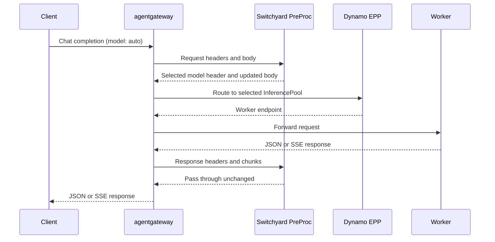

<!--
SPDX-FileCopyrightText: Copyright (c) 2025-2026 NVIDIA CORPORATION & AFFILIATES. All rights reserved.
SPDX-License-Identifier: Apache-2.0
-->

# Switchyard PreProc for Dynamo

Run Switchyard as a separate ExtProc service behind agentgateway 1.0.0. The gateway sends
an OpenAI Chat Completions request to PreProc before matching its HTTPRoute. Switchyard
chooses the model; the selected model's Dynamo EPP chooses the worker.



This directory owns the service, tests and image build. The
[Dynamo deployment example](https://github.com/ai-dynamo/dynamo/tree/main/examples/backends/vllm/deploy/gaie/switchyard)
owns the Kubernetes manifests and model-pool bindings. It assumes the cluster, gateway
controller, model workers and EPPs are already installed.

## Build the image

From the Switchyard repository root, use Docker to build and publish an image to a registry
your cluster can pull from:

```bash
export PREPROC_IMAGE=registry.example.com/your-project/switchyard-preproc:example
docker build -f examples/dynamo-preproc/Dockerfile -t "$PREPROC_IMAGE" .
docker push "$PREPROC_IMAGE"
```

Set that image in Dynamo's Kustomization and follow its deployment instructions.
The image uses the workspace Switchyard crates and precompiled Envoy bindings;
it uses the repository's shared lockfile and does not require a Dynamo checkout or a protobuf compiler.

## Configure routing

The supplied [routes.toml](config/routes.toml) uses StageRouter to choose between the two
Qwen models. Send `model: "auto"`; add `X-Switchyard-Session-Id` to retain routing state.
Send `X-Switchyard-Session-Final: true` on the final request to release its session admission
slot after a successful routing decision. Otherwise, idle slots expire after one hour.

To change routing, edit the TOML in the Dynamo deployment example and reapply its
Kustomization. Keep model IDs aligned with the HTTPRoutes and InferencePools.
Policies must select a model without generating a response or rewriting the request.

This example supports text and tool history with one PreProc replica. Routing state resets
on restart; Dynamo load and cache signals are not used.

## Concurrency and timeouts

agentgateway 1.0.0 sends responses through PreProc and cannot disable those phases.
Each request holds a stream slot until its response finishes. Set `MAX_ACTIVE_STREAMS` to change
the default of 16 per replica. Preprocessing also has a separate limit of eight concurrent
requests; reaching either limit returns HTTP 503. Raising the stream limit increases memory
and response-forwarding work.

PreProc allows 120 seconds of response inactivity, resetting the deadline on each message.
It also releases stream slots if output forwarding stalls for 120 seconds.
The Dynamo example's HTTPRoute uses a separate 120-second request deadline: in agentgateway
1.0.0 it bounds the wait for upstream response headers, measured from request start, rather
than the duration of an active response stream.
